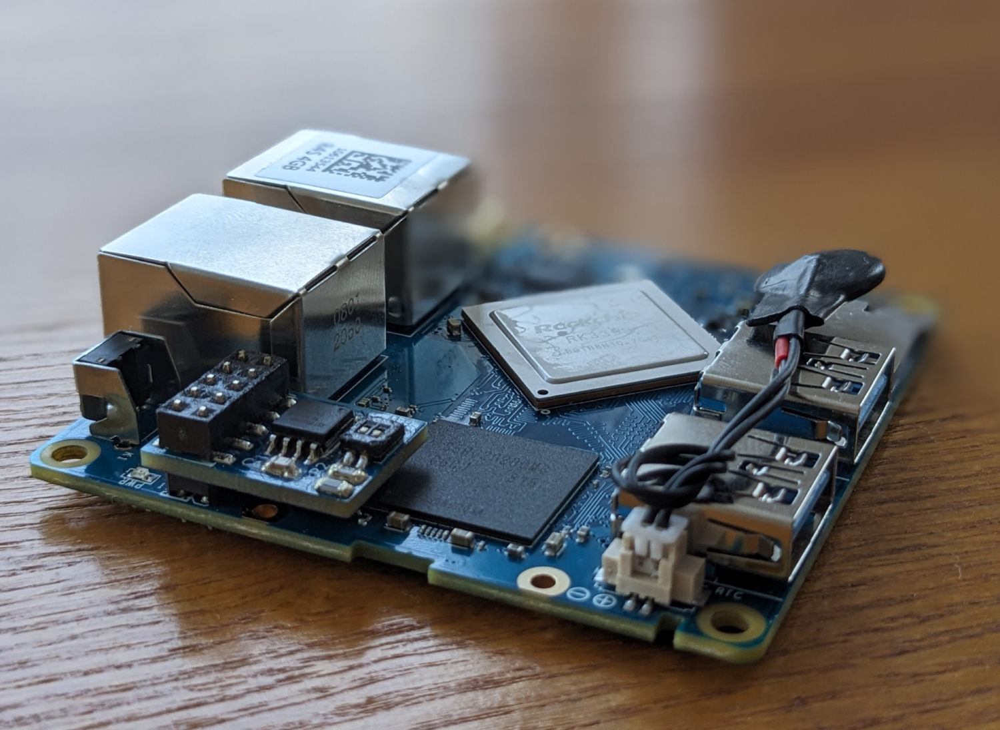

# NanoPi R4S SPI Flash Board

A small PCB adding an SPI Flash and i2c EEPROM using the GPIO header.

In order to be low-profile enough to fit inside the metal enclosure the pin header used is [Harwin M20-7810545](https://www.harwin.com/products/M20-7810545/).

Blog post: https://codedbearder.com/posts/nanopi-r4s-spi-flash/
